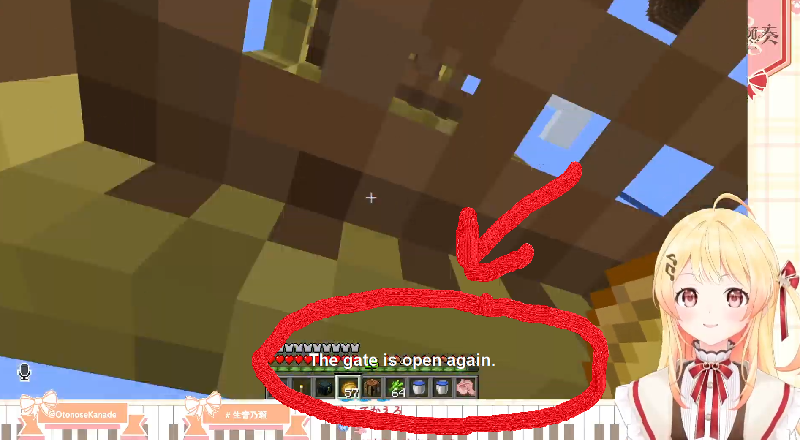
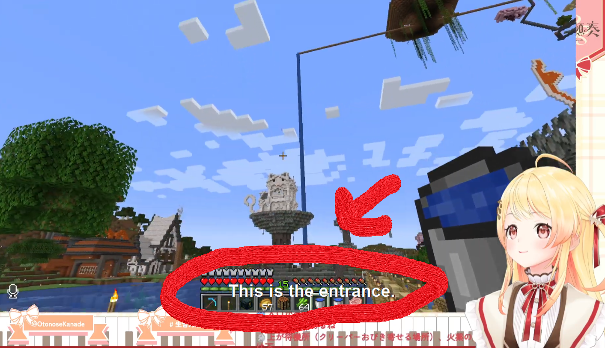

# Stream_translation_transcripter




I like watching Vtubers, but I do not know Japanese well, so I resort to watching translated clips on YouTube. However, I want to start watching them via live stream to engage more.
This application provides a real-time transcription and translation overlay that listens to spoken Japanese audio in your system, transcribes it using Vosk, translates it into English using Facebook's M2M100 model, and displays the translated text on a transparent overlay. 

---

## Features

- **Real-Time Transcription**: Captures and transcribes spoken Japanese system audio in real time using the Vosk speech recognition engine.
- **Machine Translation**: Translates Japanese text into English using Facebook's M2M100 model.
- **Transparent Overlay**: Displays the translated text on a transparent overlay that stays on top of other windows.
- **Sentence Splitting**: Splits transcriptions into individual sentences based on Japanese punctuation (`。`, `！`, `？`) before translation.
- **Minimalist Design**: The overlay uses a clean, bold font with a black background and white text for high visibility.

---

## Prerequisites

Before running the application, ensure you have the following installed:

### 1. Python 3.11
The torch and transformer libraries were not working as wanted in Python 3.13, so I ended up using Python 3.11 to solve any version conflicts.

### 2. Required Libraries
Install the required Python libraries in requirements.txt

### 3. Pre-Trained Models
- **Vosk Model**: Download the Japanese Vosk model (`vosk-model-ja-0.22`) from [Vosk Models](https://alphacephei.com/vosk/models). Place the extracted folder in the `./models/` directory.
- **M2M100 Model**: The script automatically downloads the `facebook/m2m100_418M` model during the first run. Ensure you have internet access.

### 4. System audio Access
To capture system audio, download and install VB-Cable from [VB-Cable](https://vb-audio.com/Cable).

---

## Installation

1. Clone the repository:

2. Install dependencies:

3. Download and extract the Vosk Japanese model:
   - Download the model from [Vosk Models](https://alphacephei.com/vosk/models).
   - Extract it into the `./models/` directory so that the path looks like this:
     ```
     ./models/vosk-model-ja-0.22/
     ```
4. Run the application:


---

## Usage

1. Start the application by running `main.py`.
2. Play Japanese audio on your system. The application will:
   - Transcribe the speech into text.
   - Translate the text into English.
   - Display the translated text on the transparent overlay.
3. Press `Ctrl+C` in the terminal to stop the application.

---

## License

This project is licensed under the MIT License. See the [LICENSE](LICENSE) file for details.

---

